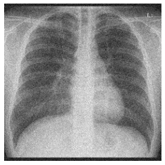
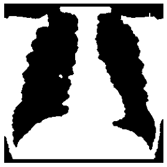

<h1 align="center">MRF Segmentation via Graph Cuts</h1>
    

  </img>
  </img>
  </img>
  </img>

 
This is an implementation of ["Exact Maximum *A Posteriori* Estimation for Binary Images"](https://rss.onlinelibrary.wiley.com/doi/abs/10.1111/j.2517-6161.1989.tb01764.x) (D. Greig, B. Porteous and A. Seheult)
       
## Usage:
See [`code/main.ipynb`](code/ipynb.mlx) and run it cell by cell
